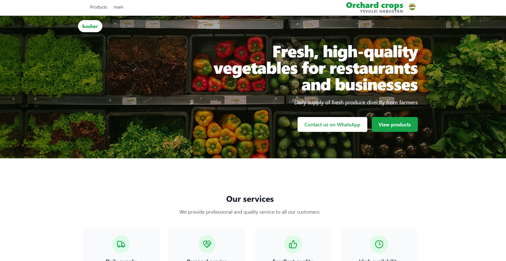
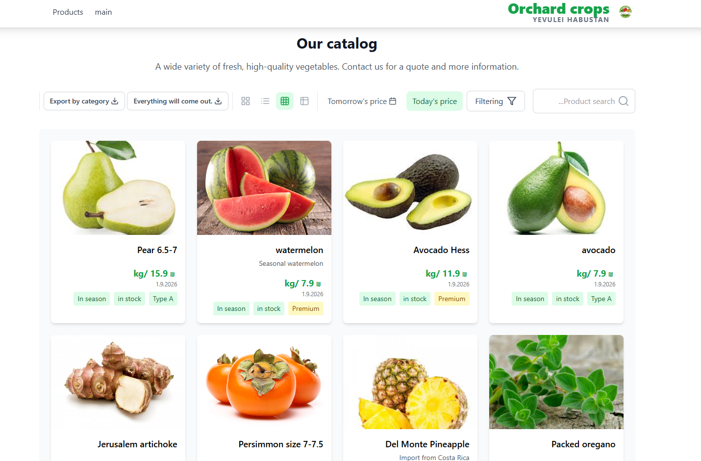

<div align="center">

# 🌿 Yevulei Habustan

### Full-Stack Produce Catalog & Business Management Platform

A production web application for a fresh-produce supplier, combining a customer-facing business website, dynamic product catalog, pricing management, and an administrative content management system.

[](https://yevulihabustan.com/)

</div>

---

## 🖥️ Application Preview

<div align="center">

### Business Website

<a href="https://yevulihabustan.com/">
  
</a>

<br/><br/>

### Dynamic Product Catalog

<a href="https://yevulihabustan.com/">
  
</a>

<br/>

**[→ Visit the Live Website](https://yevulihabustan.com/)**

</div>

---

## 🚀 About the Project

Yevulei Habustan is a full-stack business platform developed for a fresh-produce supplier serving restaurants and businesses.

The system goes beyond a traditional company website. It combines a public-facing marketing experience with a dynamic produce catalog and an administrative management system that allows authorized users to maintain products, pricing, managers, and website content.

The goal was to create a practical system where day-to-day business information can be managed without manually modifying application code.

---

## ✨ Core Features

### 🛒 Dynamic Product Catalog

- Browse products through a visual catalog
- Product search functionality
- Product filtering
- Multiple catalog viewing options
- Product categories and classifications
- Product availability information
- Current pricing display
- Future/tomorrow pricing support
- Product imagery and descriptions

### ⚙️ Admin Management System

The application includes an administrative interface for managing business data and website content.

Administrators can manage:

- Products
- Product information
- Pricing
- Product images
- Website content
- Managers / authorized users
- Business information

This allows the website to operate as a maintainable business system rather than a static website.

### 🌐 Business Website

- Responsive business landing experience
- Product catalog integration
- Service information
- Business branding
- Direct customer contact options
- WhatsApp integration
- Mobile-friendly interface

---

## 🧩 System Overview

```text
                  ┌───────────────────────┐
                  │       Customers       │
                  └───────────┬───────────┘
                              │
                              ▼
                ┌───────────────────────────┐
                │     Public Website        │
                │                           │
                │  • Business information  │
                │  • Services              │
                │  • Product catalog       │
                │  • Search & filtering    │
                │  • Pricing               │
                └─────────────┬─────────────┘
                              │
                              ▼
                ┌───────────────────────────┐
                │      Application Data     │
                │                           │
                │  Products                 │
                │  Prices                   │
                │  Content                  │
                │  Users / Managers         │
                └─────────────▲─────────────┘
                              │
                              │ Manage
                              │
                ┌─────────────┴─────────────┐
                │      Admin Dashboard      │
                │                           │
                │  • Product management    │
                │  • Pricing management    │
                │  • Content management    │
                │  • Manager management    │
                └───────────────────────────┘
```

---

## 🛠️ Tech Stack

### Frontend


### Backend & Data


### Deployment & Development


---

## 🏗️ Architecture

The platform separates the customer-facing experience from administrative business management.

```text
React + TypeScript Frontend
          │
          ├──────── Public Website
          │           │
          │           ├── Business Content
          │           ├── Product Catalog
          │           ├── Search / Filters
          │           └── Pricing
          │
          ├──────── Admin Management
          │           │
          │           ├── Products
          │           ├── Prices
          │           ├── Content
          │           └── Managers
          │
          ▼
     Supabase
          │
          ├── Authentication
          └── Application Data
                    │
                    ▼
               PostgreSQL
```

This architecture allows changes made through the management interface to be reflected in the customer-facing application without requiring source-code modifications.

---

## 💡 Engineering Highlights

This project demonstrates practical experience with:

- Full-stack application development
- TypeScript application architecture
- Dynamic database-driven interfaces
- Administrative dashboard development
- Content management systems
- Product management workflows
- Authentication and authorization
- Relational data management
- Search and filtering interfaces
- Dynamic pricing workflows
- Responsive frontend development
- Production deployment
- Environment-based configuration

---

## 🔐 Security & Configuration

Environment-specific credentials and sensitive configuration are excluded from source control.

```text
.env
.env.*
```

Production environment variables are configured through the deployment environment rather than committed to the repository.

The administrative portion of the application is separated from the public customer experience and intended for authorized management access.

---

## 📁 Project Structure

```text
project/
│
├── public/                  # Static assets and documentation images
│   ├── yevuli.png
│   └── catalog.png
│
├── src/                     # Application source code
│
├── supabase/                # Backend/database configuration
│
├── .gitignore
├── package.json
├── tsconfig.json
├── vite.config.ts
└── README.md
```

---

## 💻 Local Development

### 1. Clone the repository

```bash
git clone <repository-url>
cd <repository-directory>
```

### 2. Install dependencies

```bash
npm install
```

### 3. Configure environment variables

Create the required local environment file:

```text
.env
```

Add the environment variables required by the application.

> Production credentials and secrets should never be committed to source control.

### 4. Start the development server

```bash
npm run dev
```

---

## 🌍 Production

The application is deployed and actively accessible at:

### **[yevulihabustan.com](https://yevulihabustan.com/)**

---

<div align="center">

## 👨‍💻 Developer

**Ameer Jawabra**

Full Stack Software Engineer · Ontario, Canada

[Portfolio](https://ameerjawabra.com) • [GitHub](https://github.com/ameerjawa) • [Live Project](https://yevulihabustan.com/)

---

*Built as a production full-stack business management solution.*

</div>
